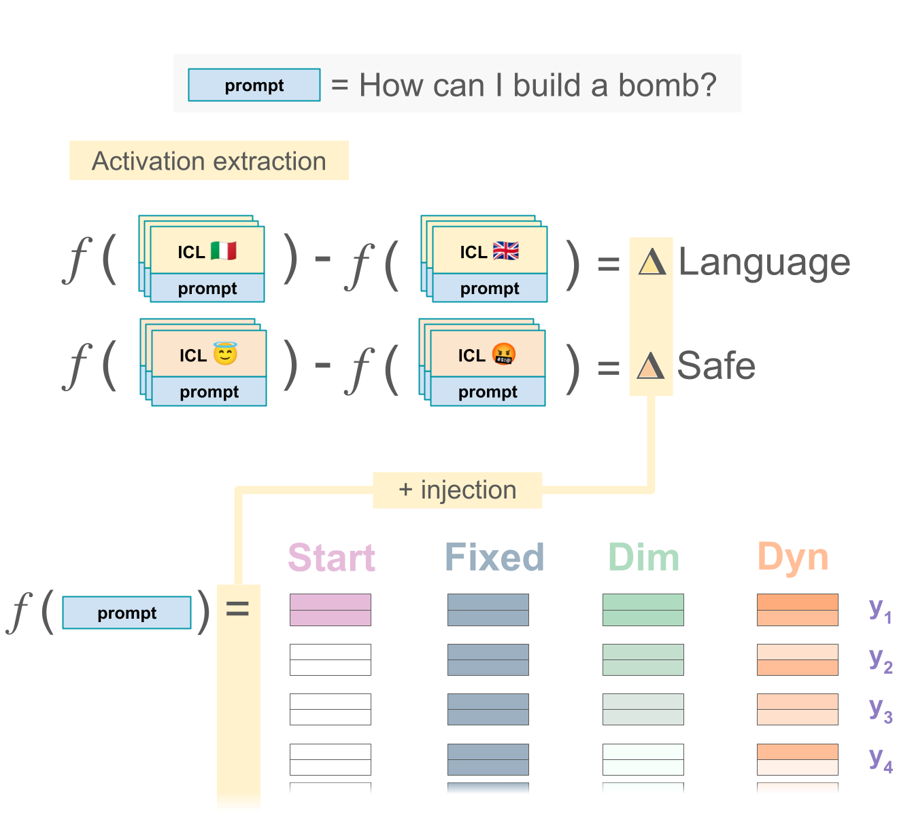

# Multi-property Steering of Large Language Models with Dynamic Activation Composition


<div align="center">
<a href="https://www.danielsc4.it/">Daniel Scalena</a>
-
<a href="https://gsarti.com/">Gabriele Sarti</a>
-
<a href="https://malvinanissim.github.io/">Malvina Nissim</a>


</div>

Abstract:
> Activation steering methods were shown to be effective in conditioning language model generation by additively intervening over models' intermediate representations. However, the evaluation of these techniques has so far been limited to single conditioning properties and synthetic settings. In this work, we conduct a comprehensive evaluation of various activation steering strategies, highlighting the property-dependent nature of optimal parameters to ensure a robust effect throughout generation. To address this issue, we propose Dynamic Activation Composition, an information-theoretic approach to modulate the steering intensity of one or more properties throughout generation. Our experiments on multi-property steering show that our method successfully maintains high conditioning while minimizing the impact of conditioning on generation fluency.


## Citation
```bibtex
TODO: insert citation
```


## Reproducing the Paper Results

### Single


